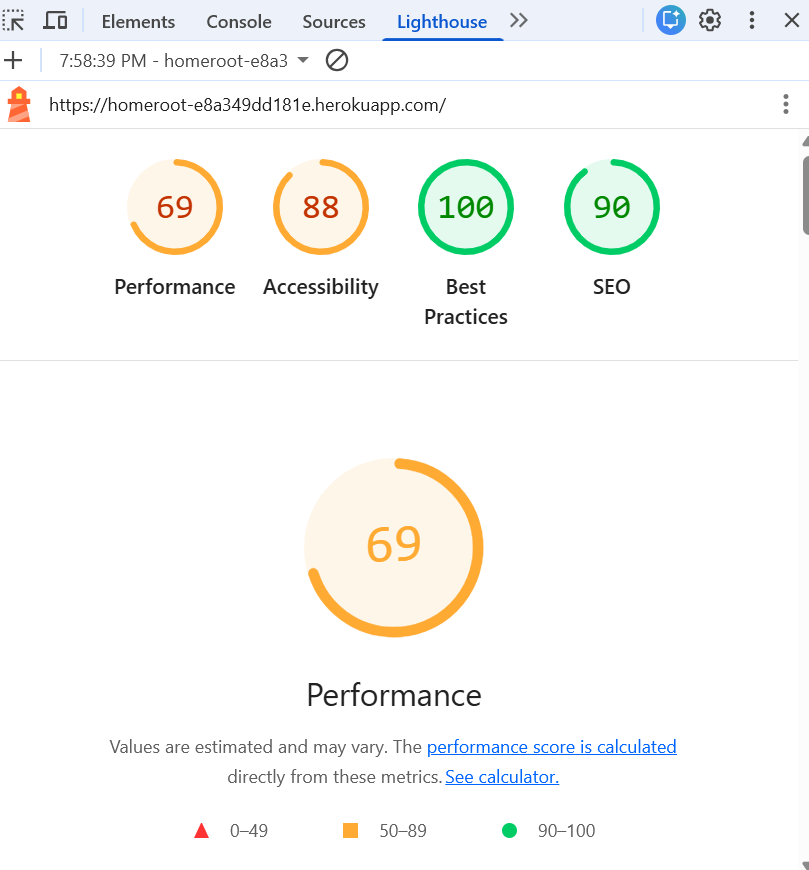

# 🌿 HomeRoots – Homeschool Planner & Progress Tracker

HomeRoots is a full-stack Django web application designed to help homeschooling families manage lessons, track progress, organise students, and simplify daily planning.  
This project was created as part of my Backend Development Milestone, but it is also inspired by my personal experience homeschooling my children.

---

## 🌱 Personal Motivation

I am a mother of three — a 1-year-old boy, a 4-year-old girl, and a 5-year-old boy — and starting the homeschooling journey was overwhelming. I constantly searched for lesson templates, trackers, and organisational tools, but everything was scattered across multiple websites.

I created **HomeRoots** as a single place where parents can:

- Plan lessons  
- Track student progress  
- Organise multiple children at different levels  
- View overall grades and improvement  
- Keep everything structured and reliable  

In the future, I would like to expand HomeRoots to include printable worksheets and a complete homeschool resource package.

---

# ✨ Features

## 👧 Student Management
- Create, edit, delete student profiles  
- Upload profile images  
- View student dashboards  

## 📘 Lesson Planner
- Add, edit, delete lessons  
- View a lesson dashboard  
- Assign lessons to students  

## 📊 Progress Tracking
- Mark lessons as completed  
- Add grades (0–100)  
- Automatic overall grade calculation  
- Line chart visualising student progress  

## 📨 Contact Form
- Styled contact page  
- Form submits messages  
- Currently uses Django console backend  

## 🎨 User Interface
- Soft green visual theme  
- Rounded cards and modern layout  
- Fully responsive  
- Clean typography  

---

# 🛠 Technologies Used

- Python 3 / Django 5  
- SQLite3  
- HTML / CSS / Bootstrap 5  
- Chart.js  
- Google Fonts  
- Django Messages Framework  
- Django Class-Based Views  
- AI-generated images from DeepAI  

---

# 🗂 Information Architecture

---

## 🗃 Database Schema

HomeRoots uses a relational database to manage students, lessons, and progress records. The data model reflects homeschooling relationships in real life and supports full CRUD functionality.


## 📌 Student Model
Stores each students information.

**Fields:**
- first_name  
- last_name  
- date_of_birth  
- profile_image  
- created_at  

Each student can have multiple lessons linked to them to then show progress.

## 📌 Lesson Model
Stores lesson details.

**Fields:**
- title  
- subject  
- description  
- created_at  

Each lesson can be assigned to multiple students through the progress page.

## 📌 LessonProgress Model
Acts as a junction table between Students and Lessons.

**Fields:**
- student (ForeignKey)  
- lesson (ForeignKey)  
- status (Pending / Completed)  
- grade (0–100)  
- updated_at  

## 🔗 Relationships Summary
- One Student → Many LessonProgress records  
- One Lesson → Many LessonProgress records  
- LessonProgress links both Students and Lessons together  

This structure allows user to track lessons completed and grades for multiple students.

---

## 🗄 Entity Relationship Diagram (ERD)

The diagram below shows the relationship between Student, Lesson and LessonProgress models.

- One Student can have many LessonProgress records.
- One Lesson can have many LessonProgress records.
- LessonProgress acts as a junction table linking Students and Lessons.
- A unique constraint prevents duplicate student-lesson pairs.


---

# 📸 Screenshots

## Homepage


## Students Dashboard


## Lessons Dashboard


## Progress Tracker


## Contact Page


---

# 🧪 Testing

All testing was carried out manually to verify that the applications features functions as expected.  
Most testing was done late at night after my children were asleep, which helped me properly focus on each feature.

---

## ✅ Student Management

| Test | Result |
|------|--------|
| Add student | Pass |
| Edit student | Pass |
| Delete student | Pass |
| Required field validation | Pass |
| Profile image upload | Pass |
| Dashboard display | Pass |

---

## ✅ Lesson Management

| Test | Result |
|------|--------|
| Create lesson | Pass |
| Edit lesson | Pass |
| Delete lesson | Pass |
| Assign lesson to student | Pass |
| Lesson dashboard view | Pass |

---

## ✅ Progress Tracking System

| Test | Result |
|------|--------|
| Assign lesson to student | Pass |
| Mark lesson as completed | Pass |
| Save grade (0–100) | Pass |
| Grade displayed correctly | Pass |
| Chart updates dynamically | Pass |

---

## ✅ Contact Form

| Test | Result |
|------|--------|
| Empty fields validation | Pass |
| Valid submission | Pass |
| Success message displayed | Pass |
| Console receives message | Pass |

---

## ✅ Navigation & UI

| Test | Result |
|------|--------|
| Navbar links | Pass |
| Breadcrumb navigation | Pass |
| No broken links | Pass |
| Clean page transitions | Pass |

Although several minor design and configuration issues were discovered during testing, no major bugs remain in the deployed version.

---

## ✅ Lighthouse Testing

Lighthouse testing was performed using Chrome DevTools on the deployed Heroku application.

### Results
- **Performance:** 69  
- **Accessibility:** 88  
- **Best Practices:** 100  
- **SEO:** 90  



### Summary

- Performance score reflects Heroku free-tier cold starts and large hero image loading.
- Accessibility is strong with proper form labels and semantic HTML structure.
- Best Practices achieved a full score due to secure deployment and environment variable handling.
- SEO score confirms proper heading structure, responsive design, and clean routing.

Future improvements include image optimisation and performance enhancements.

## ✅ Bugs & Fixes (Traceable)

> **Update for feedback:** Testing evidence needs to clearly show bugs found, what I changed, and what the result was (Merit M(vi)). :contentReference[oaicite:3]{index=3}  
Here are the main issues I found during development and how they were fixed:

| Bug / Issue | What was happening | Fix applied | Result |
|---|---|---|---|
| Static files not loading on Heroku | CSS/JS missing in production | Configured static settings + ran `collectstatic` + ensured WhiteNoise is enabled | Styling loads correctly |
| Missing tables after deploy | Pages erroring due to migrations not applied | Ran migrations locally + on Heroku, confirmed migration order | Data loads correctly |
| Broken links between pages | Some navigation routes were wrong | Updated URL patterns and templates | All internal links work |
| Image upload issues | Upload not saving/displaying reliably | Corrected MEDIA settings + upload handling | Images display correctly |

All bugs were fixed before final deployment.

---

# 🧭 User Feedback & UX Improvements

> **Update for feedback:** The app needs more consistent user feedback for CRUD actions (messages + form errors), not just framework defaults (Merit M(i) + M(ii)). :contentReference[oaicite:4]{index=4}

To improve this, the project includes / will include:
- Clear success messages after create/edit/delete actions (site-wide consistency)
- Clear inline form errors when something is missing or invalid
- Better guidance text so users know what went wrong and what to do next


---

# 📱 Responsive Testing

Due to Iframe embedding protection being enabled, all responsive testing was completed using Chrome Browser Developer Tools to simulate real-world screen sizes and devices.

The following viewports were tested:
- Mobile (iPhone SE / iPhone 12)
- Tablet (iPad)
- Desktop (1080p and above)
- Landscape and portrait orientations

## 📸 Responsive Testing Screenshots (Browser DevTools)

**Homepage – Mobile View**  


**Students Dashboard – Tablet View**  


**Lessons Dashboard – Mobile View**  


**Progress Chart – Small Screen Landscape**  


# 🔍 Validator Testing

## HTML Validation
Tested using W3C HTML Validator  


✔ No major structural errors

## CSS Validation
Tested using W3C CSS Jigsaw  


✔ Pass – no invalid rules

---

## ✅ Python (PEP8) Validation

All custom Python files in this project were checked using pycodestyle to make sure the code follows PEP8 standards.

The following command was used to run the initial test:

```bash
python -m pycodestyle .
```

To ensure only the project’s own files were checked this command was then used:
```bash
python -m pycodestyle . --exclude=.venv
```

Results showed that most of the warnings were related to formatting only, such as:

- Lines being slightly longer than the recommended 79 characters
- Spacing between functions and classes
- Import placement in the settings file
- Minor whitespace formatting
These are all styling issues only and do not affect how the project works.
All main features of the application were tested and confirmed to work as expected.

Overall, the Python code has been validated and is functioning correctly.

## ✅ JavaScript (JSHint) Validation
JSHint was used to check the JavaScript in this project for any errors or potential issues.

The following command was used:

jshint core/static/

During testing, most of the warnings came from a Django admin vendor file located in:

homeschool_planner/staticfiles/admin/js/vendor/xregexp/xregexp.min.js

This file is automatically generated by Django and is not part of the project’s code.

These warnings were safely ignored because they do not affect the functionality of this project.

All JavaScript written for HomeRoot was tested and is working.

# 📁 Folder Pathway


# 📝 Project Planning
Wireframes 


# 🧭 User Stories
- As a homeschooling parent, I want to add my children so their learning can be organised individually.
- As a parent, I want to plan and save lessons for future use.
- As a parent, I want to assign lessons and track when they’re completed.
- As a parent, I want to give grades and see improvement visually.
- As a user, I want to contact the site owner easily through a simple form.
# 🔒 Security (Resubmission Update)

This section is added to directly address the security feedback (Pass 5.2 + 5.3). 


## Secret Key & Environment Variables

A previous version of this project included a sensitive secret value committed to the repository (Django SECRET_KEY).
This has been corrected by:

1. Removing the committed SECRET_KEY from the repository

2. Rotating the key (new key generated)

3. Loading secrets through environment variables instead of hardcoding them

4. Ensuring the .env file is ignored by Git

5. Adding an .env.example file so setup instructions are safe

- Example pattern (settings.py):

import os

SECRET_KEY = os.environ.get("SECRET_KEY")
DEBUG = os.environ.get("DEBUG", "False") == "True"

### Deployment Safety

- DEBUG disabled in production

- Sensitive values stored in Heroku Config Vars

- No secrets stored in GitHub

# 🔐 Authentication & Restricted Routes (Planned Improvement)

Feedback note: Data-changing routes should be restricted to logged-in users to strengthen access control and UX expectations. 


This is listed as a planned improvement:

- Add login/logout for end users

- Protect create/edit/delete/progress update routes using login requirements

# 🚀 Deployment
HomeRoots was deployed using Heroku so that it can be accessed live on the web.
The live site can be found here:

## 🔗 Live Site: https://homeroot-e8a349dd181e.herokuapp.com/

### Running the Project Locally
To run this project on your own computer, follow the steps below:

1. Clone the repository:
git clone https://github.com/yourusername/your-repo-name.git

2. Navigate into the project folder:
cd your-repo-name

3. Create and activate a virtual environment:
python -m venv venv

- Windows: venv\Scripts\activate

- Mac/Linux: source venv/bin/activate

4. Install the project dependencies:
pip install -r requirements.txt

5. Create a .env file and add the following values:
SECRET_KEY=your_secret_key
DEBUG=True
DATABASE_URL=sqlite:///db.sqlite3

6. Apply the database migrations:
python manage.py migrate

7. Create a superuser for the admin panel:
python manage.py createsuperuser

8. Run the development server:
python manage.py runserver

9. Open the project in your browser:
http://127.0.0.1:8000/

### Heroku Deployment
The following steps were used to deploy the project to Heroku:

1. A new Heroku app was created.
The following Config Vars were added:
- SECRET_KEY
- DATABASE_URL
2. Production dependencies were installed:
- gunicorn
- dj-database-url
- psycopg2-binary
- whitenoise
3. A Procfile was created to run the application.
5. Static files were collected using:
- python manage.py collectstatic

6. The project was pushed to Heroku using Git.
7. Database migrations were run on Heroku.
8. Once completed, the site became fully accessible online.

# 📝 Assessment Criteria Alignment
✔ Full CRUD functionality
✔ Relational database design
✔ Secure cloud deployment
✔ Django framework conventions
✔ Responsive front-end
✔ Manual testing documentation
✔ Version control using GitHub
✔ Security practices applied
✔ Professional documentation

# 📚 Credits & Sources
### Documentation
- Django Documentation – https://docs.djangoproject.com/
- Bootstrap Documentation – https://getbootstrap.com/
- Chart.js Documentation – https://www.chartjs.org/docs/latest/
### Other Resources
- Google Fonts – https://fonts.google.com
- Bootstrap Icons – https://icons.getbootstrap.com
### Image Sources
- AI-generated illustrations using DeepAI
- AI-generated support image used on Contact Page
### Technical Support
- StackOverflow (debugging reference) – https://stackoverflow.com/
# 🌟 Future Improvements
I hope to extend this app with:

- Printable worksheets for homeschool subjects
- A weekly planner PDF generator
- Student login system
- Parent dashboard
- Drag-and-drop lesson scheduler
- Cloud storage for worksheets
- Curriculum templates for different ages
# 💬 Reflection
Building HomeRoots was one of the most challenging but rewarding projects I have worked on so far. Balancing this project alongside parenting three young children made time management extremely difficult, but it also reinforced why this project mattered so much to me personally.

During development, I faced several serious delays and was granted an official extension to complete the project. One of the biggest obstacles was ongoing technical issues with my original laptop, which significantly slowed my progress. After researching the most suitable laptop for programming and development, I made the decision to purchase a new one on the official submission date so that I could finally complete, deploy, and submit the project properly.

Although these challenges caused unavoidable delays, I remained committed to finishing HomeRoots to the best of my ability. Completing this project under such difficult circumstances has made the achievement even more meaningful to me.

This project helped me fully understand how a full-stack web application works — from database modelling and CRUD logic to templates, deployment, and debugging live errors. Some issues took forever to solve, but working through them built my confidence and embedded knowledge that will help me in my web development career.

HomeRoots represents both my technical growth and a real solution to a real need in my own life. The skills I’ve gained from this project will strongly influence how I approach development work in the future.

👩‍💻 Author
Ana Samanda Dicha De Sousa Web Application Development – Level 5 Diploma GitHub: https://github.com/Anasousa11